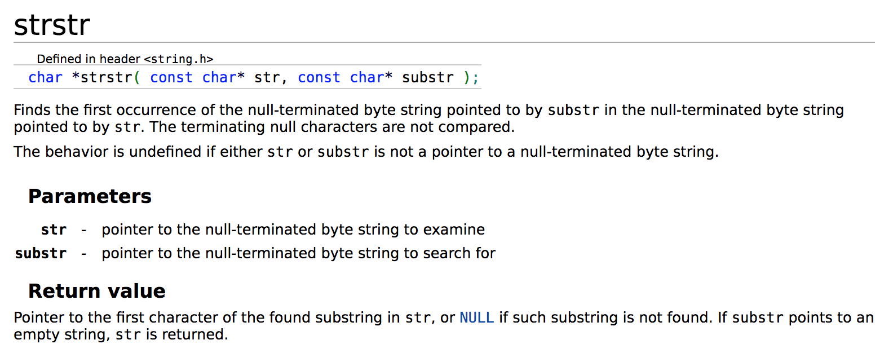

# [1408. 数组中的字符串匹配](https://leetcode-cn.com/problems/string-matching-in-an-array/)

> ghost 2020年7月11日
>
> 难度：==简单==

## 问题描述

给你一个字符串数组` words` ，数组中的每个字符串都可以看作是一个单词。请你按 任意 顺序返回 words 中是其他单词的子字符串的所有单词。

如果你可以删除 `words[j]` 最左侧和/或最右侧的若干字符得到 `word[i]` ，那么字符串 `words[i] `就是 `words[j]` 的一个子字符串。

 

示例 1：

```
输入：words = ["mass","as","hero","superhero"]
输出：["as","hero"]
解释："as" 是 "mass" 的子字符串，"hero" 是 "superhero" 的子字符串。
["hero","as"] 也是有效的答案。
```


示例 2：

```
输入：words = ["leetcode","et","code"]
输出：["et","code"]
解释："et" 和 "code" 都是 "leetcode" 的子字符串。
```

示例 3：

```
输入：words = ["blue","green","bu"]
输出：[]
```


提示：

- `1 <= words.length <= 100`
- `1 <= words[i].length <= 30`
- `words[i] `仅包含小写英文字母。
- 题目数据 保证 每个 `words[i] `都是独一无二的。

## C

### 解题思路A

暴力解法

- 通过两层循环判断字符串是否是别人的子字符串
- 如果是，则将该字符串放入结果中

问题：如果有子字符串的子字符串怎么办

问题不大，好像是合法的

使用`strstr`函数来作为子字符串判断，头文件是`string.h`

这个函数返回的是在主字符串中找到子字符串所在的位置的指针pointer， 如果不是子字符串，则返回`NULL`



```C
char ** stringMatching(char ** words, int wordsSize, int* returnSize){
    if(words==NULL || wordsSize <= 0){
        *returnSize = 0;
        return NULL;
    }
    char **result = (char**)malloc(sizeof(char*)*(wordsSize)+1);
    int index = 0;
    for(int i = 0; i < wordsSize; ++i){
        for(int j = 0; j < wordsSize; ++j){
            if(i != j && strstr(words[j], words[i]) != NULL ){
                result[index] = (char*)malloc(sizeof(char)*(strlen(words[i])+1));
                memcpy(result[index], words[i], strlen(words[i])+1);
                index++;
                break;
            }
        }
    }
    *returnSize = index;
    return result;
}
```


这里遇到的一个问题就是WSL下的`gcc (Ubuntu 9.3.0-10ubuntu2) 9.3.0`没有找到`strstr`函数，gdb报错

```shell
Program received signal SIGSEGV, Segmentation fault.
__strstr_sse2_unaligned () at ../sysdeps/x86_64/multiarch/strstr-sse2-unaligned.S:22
22      ../sysdeps/x86_64/multiarch/strstr-sse2-unaligned.S: No such file or directory.
```


尝试写一个`strstr`函数

```C
char *substr(const char *str,const char* substr){
    int len1 = strlen(str), len2 = strlen(substr);
    if(len1 < len2) return 0;
    int index = 0;
    for(;index<len1-len2; ++index){
        if(strncmp(str+index, substr, len2) == 0){
            return str+index;
        }
    }
    return NULL;
}
```


## 结果

执行结果：

==通过==

显示详情

执行用时：4 ms, 在所有 C 提交中击败了91.11%的用户

内存消耗：5.9 MB, 在所有 C 提交中击败了100.00%的用户


### 解题思路B

在讨论区看到的，将所有的字符串拼接在一起，如果是子字符串，那么至少回出现两次，在每个字符串之间插入`,`似乎是个不错的想法

不写了，编译器有问题。