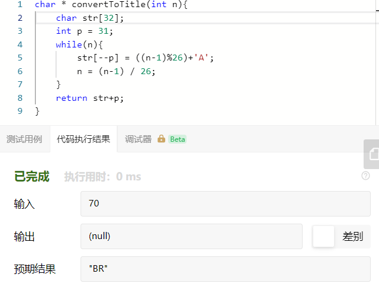
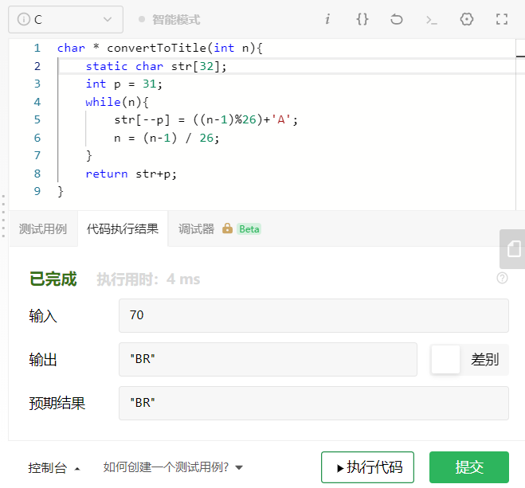

# 168-Excel表列名称

> ghost 2020年7月14日
>
> 难度：==简单==

## 题目描述

给定一个正整数，返回它在 Excel 表中相对应的列名称。

例如，

    1 -> A
    2 -> B
    3 -> C
    ...
    26 -> Z
    27 -> AA
    28 -> AB 
    ...
示例 1:

```
输入: 1
输出: "A"
```


示例 2:

```
输入: 28
输出: "AB"
```

**示例 3:**

```
输入: 701
输出: "ZY"
```

来源：力扣（LeetCode）

## 解题思路

这是一道非常简单的题目，是简单的26进制转换，如果用java，python之类的语言，估计就一行代码的事情，但是在C中，在不调用其他资源的前提下，我们就需要对字符串进行处理。

1-26对应A-Z，与进制0开头的相差的一位，这里需要简单注意一下，相当于在计算的时候，总体要做减一处理

在评论区看到某个评论，直接使用长度为32位的char数组，猜测目标不超过32位，直接一遍过了，从末往前赋值，然后直接返回结果即可。

另外需要注意一点的是，如果我们需要将我们的变量返回，需要设置静态变量，不然当指针离开作用域之后，内存就被销毁了，得到的就只是一个空的对象。







## 代码十分简单

```C
char * convertToTitle(int n){
    static char str[32];
    int p = 31;
    while(n){
        str[--p] = ((n-1)%26)+'A';
        n = (n-1) / 26;
    }
    return str+p;
}
```

## 不使用取巧的方式

即认为数字可以是无穷大的

算了， 没什么意义

看很多人甚至选择10位数字


