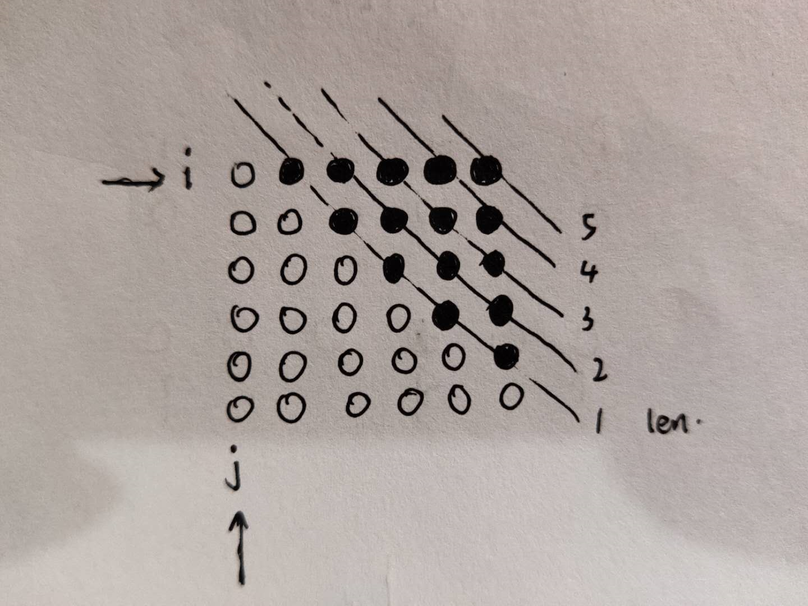

# 312-戳气球

> ghost 2020年7月19日
>
> 难度：==困难==

## 题目描述

#### [312. 戳气球](https://leetcode-cn.com/problems/burst-balloons/)

有 `n` 个气球，编号为`0` 到 `n-1`，每个气球上都标有一个数字，这些数字存在数组 `nums` 中。

现在要求你戳破所有的气球。如果你戳破气球 `i` ，就可以获得 `nums[left] * nums[i] * nums[right]` 个硬币。 这里的 `left` 和 `right` 代表和 `i` 相邻的两个气球的序号。注意当你戳破了气球 `i` 后，气球 `left` 和气球 `right` 就变成了相邻的气球。

求所能获得硬币的最大数量。

**说明:**

- 你可以假设 `nums[-1] = nums[n] = 1`，但注意它们不是真实存在的所以并不能被戳破。
- 0 ≤ `n` ≤ 500, 0 ≤ `nums[i]` ≤ 100

**示例:**

```
输入: [3,1,5,8]
输出: 167 
解释: nums = [3,1,5,8] --> [3,5,8] -->   [3,8]   -->  [8]  --> []
     coins =  3*1*5      +  3*5*8    +  1*3*8      + 1*8*1   = 167
```

## 解题思路

这题我一开始也是一头雾水，算法学的不好是这样的，第一反应是用递归，但是想了想简单的递归理论上时间复杂度太大了，肯定是不行的。

陷入僵局了许久

最终还是参考了leetcode的解题

官方的我并不想看，感觉写的稍微复杂。

然后看到了 [[这个菜谱, 自己在家也能做] 关键思路解释](https://leetcode-cn.com/problems/burst-balloons/solution/zhe-ge-cai-pu-zi-ji-zai-jia-ye-neng-zuo-guan-jian-/)这篇解析，我觉得讲的非常好，很容易理解，属于一点就通的那种。

简单介绍一下这个想法。

假设开区间`(i,j)`之间，气球`k`是最后一个戳破的，那么在这种情况下，我们使用dp的话，就有

```
dp[i][j] = dp[i][k] + nums[i]*nums[k]*nums[j] + dp[k][j]
```

也就是将`(i,j)`划分为区间`(i,k)`和`(k,j)`

因为戳破的时候，数值只跟戳破的气球两边的气球的数值有关，因此在这种情况下，这种划分方法是成立的。

因此核心思想就有了，那么接下来就是编程了

## 代码

我比较笨，写了很多无用的代码，欢迎指正，或者某天自己回来看的时候，记得修改一下。

```C
int maxCoins(int* nums, int numsSize){
    if(numsSize == 1) return nums[0];
     int N = numsSize + 2;
    //初始化dp矩阵
     int dp[N][N];
     memset(dp, 0, sizeof(int)*N*N);
    
     int max = 0, tmp = 0;
     for(int len = 2; len <= N-1; ++len){
        for(int i = 0; i < N-len; ++i){
            max = 0;tmp = 0;
            for(int k = i+1; k < i+len; ++k){
                // 一些边界条件的判定 
                // 需要注意的是nums与下标并不直接对应，相差1
                if(i == 0 && i+len == N-1){
                    tmp = dp[i][k] + dp[k][i+len]+ nums[k-1];
                }
                else if(i == 0){
                    tmp = dp[i][k] + dp[k][i+len]+ nums[k-1]*nums[i+len-1];
                }
                else if(i+len == N-1){
                    tmp = dp[i][k] + dp[k][i+len]+ nums[i-1]*nums[k-1];
                }
                else{
                    tmp = dp[i][k] + dp[k][i+len]
                        + nums[i-1]*nums[k-1]*nums[i+len-1];
                }
                if(tmp > max){max = tmp;}
            }
            dp[i][i+len] = max;
        }
     }
     return dp[0][N-1];
}

```

这是遍历的方式

