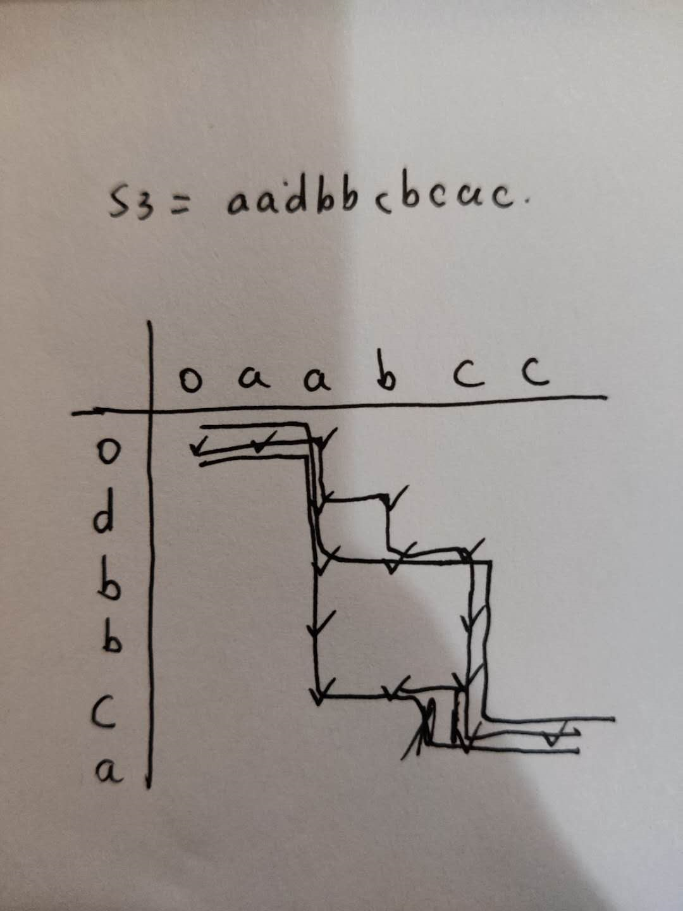

# 97-交错字符串

> ghost 2020年7月18日
>
> 难度：==困难==

## 题目描述

[97. 交错字符串](https://leetcode-cn.com/problems/interleaving-string/)

给定三个字符串 *s1*, *s2*, *s3*, 验证 *s3* 是否是由 *s1* 和 *s2* 交错组成的。

**示例 1:**

```
输入: s1 = "aabcc", s2 = "dbbca", s3 = "aadbbcbcac"
输出: true
```

**示例 2:**

```
输入: s1 = "aabcc", s2 = "dbbca", s3 = "aadbbbaccc"
输出: false
```

## 解题方法

这道题上手的第一反应是dp，那么就需要我们去找到关系式，需要判断`s3`是否由`s1`和`s2`交错组成，很自然的就想到构建一个二维的dp数组，用来存储dp数据

这是我自己选择的一种处理方式，一个轴是`s1`字符串，一个轴是`s2`字符串，设想这是一个从`[0][0]`开始出发的路径，只能向右或者向下，那么最终能否到达最右下角就表示`s3`是否是由`s1`和`s2`组成的，那么这样的方式得到的效果就是其横坐标`i`和纵坐标`j`之和是逐渐加一的，是十分规律的，那么`i+j-1`是逐步增加的，那么就可以表示这是`s3`字符串的下标，遍历到最后，也就是到了`s3`的末端。



那么如何判断dp矩阵的值是否取1呢？

`i+j-1`表示`s3`的下标，`i`表示`s1`的下标，`j`表示`s2`的下标，那么就很明显了，`s3`的字符要么来自`s1`要么来自`s2`，所以`dp[i][j]`取1的前提是`s1[i-1] == s3[i+j-1] || s2[j-1] == s3[i+j-1]`，但这个判断条件是不够的，因为路径是连续的，因此判定条件是这样的

```C
(s1[i-1] == s3[i+j-1] && dp[i-1][j] == 1) || 
(s2[j-1] == s3[i+j-1] && dp[i][j-1] == 1)
```

所以最终代码是

```C
bool isInterleave(char * s1, char * s2, char * s3){
    int len1 = strlen(s1), len2 = strlen(s2), len3 = strlen(s3);
    if(len1+len2 != len3) return false;
    int dp[len1+1][len2+1];
    int N = (len1 + 1)*(len2 + 1);
    memset(dp, 0, sizeof(int)*N);
    dp[0][0] = 1;// 第一位设置为1
    // 单独处理第一行和第一列
    for(int i = 1; i <= len1; ++i){
        if(s1[i-1] == s3[i-1] && dp[i-1][0] == 1){
            dp[i][0] = 1;
        }
    }
    for(int j = 1; j <= len2; ++j){
        if(s2[j-1]==s3[j-1] && dp[0][j-1] == 1){
            dp[0][j] = 1;
        }
    }

    for(int i = 1; i <= len1; ++i){
        for(int j = 1; j <= len2;++j){
            if((s1[i-1] == s3[i+j-1] && dp[i-1][j] == 1) 
            || (s2[j-1] == s3[i+j-1] && dp[i][j-1]==1 )){
                    dp[i][j] = 1;
            }
        }
    }
    return dp[len1][len2];
}
```


## 提交结果

执行结果：

==通过==

显示详情

执行用时：4 ms, 在所有 C 提交中击败了63.81%的用户

内存消耗：5.2 MB, 在所有 C 提交中击败了100.00%的用户